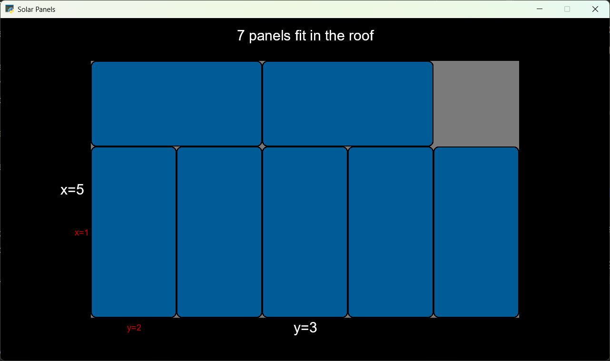

# Paneles Solares

Esta aplicación te permite simular el proceso de instalación de paneles solares
en el techo de una casa o edificio, poniendo la máxima cantidad de paneles 
que caben.

## Instalación y uso

Para instalar la aplicación es necesario contar con Python 3.10 o superior. 
Es recomendable generar un nuevo environment específico para este proyecto.
El proyecto usa las librerías pudu-ui y pyglet que se pueden instalar con pip:

`$ pip install -r requirements.txt`

Para correr la aplicación hay que ejecutar el script **main.py**:

`$ python main.py`

La app debería funcionar en Windows y Linux, y posiblemente en MacOS, con 
una tarjeta de video compatible con OpenGL 4.0.

## Supuestos

Consideraremos que los paneles tienen todos las mismas dimensiones (a, b) 
que van de 1 a 10. Mientras que el techo tiene dimensiones (x, y) que van de 
1 a 100. El programa solo considera una orientación vertical y horizontal 
para los paneles, pensando en que siempre será la mejor opción para llenar 
un techo rectangular.

## Algoritmo

Para resolver el problema se usa la función _max_panels_ dentro del archivo 
**app.py** que toma como argumentos la posición del techo, las dimensiones 
del techo y las dimensiones del panel solar. La función usa recursividad y 
en cada iteración calcula 4 opciones para poner los paneles, y de esas se 
queda con la mejor.

Las opciones son:

1. Poner los paneles uno al lado del otro, como en una fila. Esto se hace a 
   partir de la esquina inferior izquierda del techo. Luego se vuelve a 
   llamar a la función pero esta vez se reduce las dimensiones del techo 
   "cortando" la fila en que ya se pusieron esos paneles, y además se cambia 
   la posición del techo a la parte inferior izquierda del espacio sobrante.
2. Poner los paneles uno sobre el otro en una columna, también desde la 
   parte inferior izquierda, y también llamando recursivamente a la función 
   esta vez cortando la columna y moviendo la posición del techo.
3. Lo mismo que 1 pero usando la otra orientación del panel
4. Lo mismo que 2 pero usando la otra orientación del panel

El resultado es la opción que contenga más paneles. Para esto también se usa 
programación dinámica guardando una memoria de los resultados.

## Implementación

Escogí Python para esta solución ya que es un lenguaje fácil de usar y de 
rápida velocidad de desarrollo. En el front end usé mi propia librería 
pudu-ui, ya que la manejo y al estar en Python es cross-platform.

El módulo **app.py** define la clase _PanelApp_ que se encarga de hacer los 
cálculos y manejar las pantallas de settings y luego la de la simulación una 
vez que uno aprieta el botón.

En **settings_screen.py** se define la clase _SettingsScreen_ que contiene la 
"vista" de la pantalla de settings donde uno le dice al programa los valores 
para _x_, _y_, _a_ y _b_ que son las dimensiones de techo y paneles, y también
tiene el botón para empezar la simulación.

En **simulation_screen.py** se define _SimulationScreen_ que es la pantalla 
que muestra el techo con los paneles que se han decidido instalar, mostrando 
las dimensiones del techo en blanco y de los paneles en rojo y dice cuántos 
paneles caben en el techo.

Finalmente en **components.py** se definen los Widgets o componentes que se 
usan para los settings, paneles y el techo.

